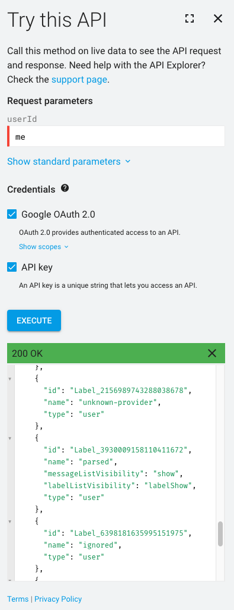
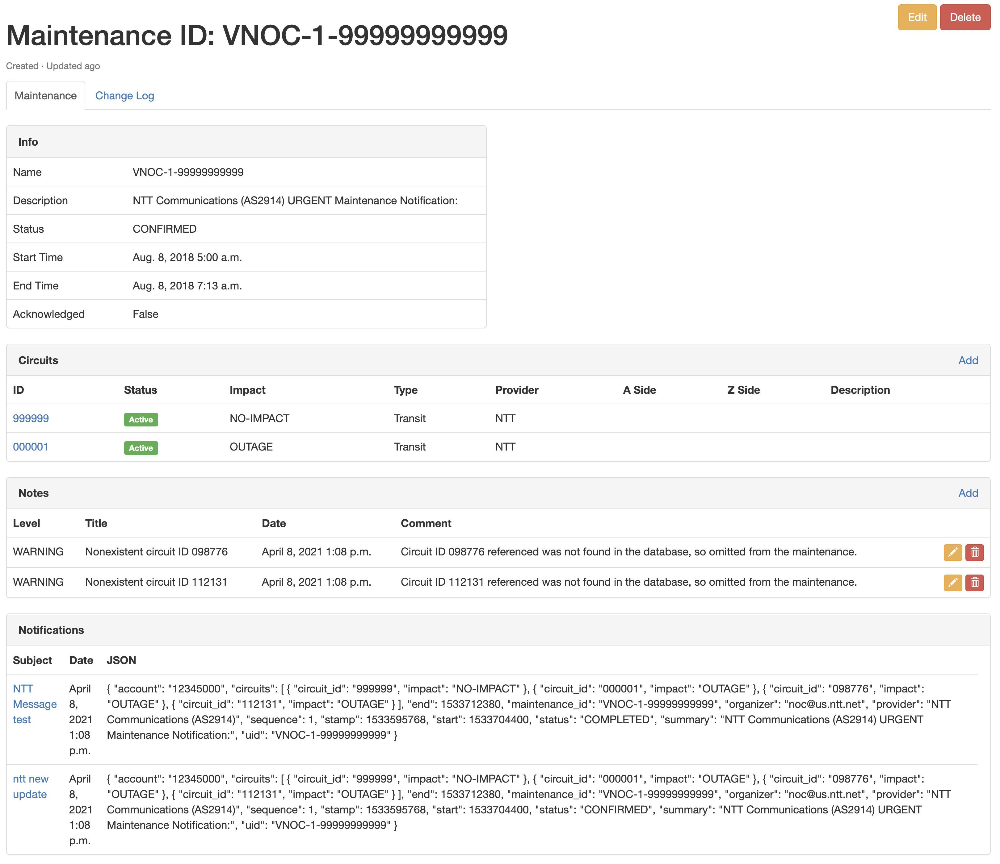

# Using the App

This document describes common use-cases and scenarios for this App.

## Use Cases

This app is generally used for integrating Circuit Maintenace notifcations from your Service Providers into your source of truth. It helps manage all the different notifications across circuits deployed within the organization. 

Once setup, Notifcations from your provider will get parsed, and notifiation objects will be created. These notification objects show both a visual cue on circuits in Nautobot as well as dashboards and other places to consume the information. 

When notifications are created, there is also a Job that may be run to determine if any Circuit Maintenance activities overlap on specific location, which may affect redundancy for the location. 

## General Usage

### Notification Sources

#### IMAP

There are 2 extra required attributes:

- `account`: Identifier (i.e. email address) to use to authenticate.
- `secret`: Password to IMAP authentication.

!!! note
    Gmail example: [How to setup Gmail with App Passwords](https://support.google.com/accounts/answer/185833)

There is also one optional attribute:

- `source_header`: Specify a particular email header to use to identify the source of a particular notification and assign it to the appropriate provider. If unset, `From` will be used, but if your emails are not received directly from the provider but instead pass through a mailing list or alias, you might need to set this to a different value such as `X-Original-Sender` instead.

```py
PLUGINS_CONFIG = {
    "nautobot_circuit_maintenance": {
        "notification_sources": [
            {
                "name": "my custom name",
                "account": os.getenv("CM_NS_1_ACCOUNT", ""),
                "secret": os.getenv("CM_NS_1_SECRET", ""),
                "url": os.getenv("CM_NS_1_URL", ""),
                "source_header": os.getenv("CM_NS_1_SOURCE_HEADER", "From"),  # optional
                "attach_all_providers": True,  # optional
            }
        ]
    }
}
```

#### Gmail API integrations

!!! note
    Typically the `url` setting to configure in your `PLUGINS_CONFIG` for use with Gmail integration will be `"https://accounts.google.com/o/oauth2/auth"`.

There are 2 extra required attributes:

- `account`: Identifier (i.e. email address) to access via OAuth or to impersonate as service account.
- `credentials_file`: JSON file containing all the necessary data to identify the API integration (see below).

There are also the following optional attributes:

- `source_header`: Specify a particular email header to use to identify the source of a particular notification and assign it to the appropriate provider. If unset, `From` will be used, but if your emails are not received directly from the provider but instead pass through a mailing list or alias, you might need to set this to a different value such as `X-Original-Sender` instead.
- `limit_emails_with_not_header_from`: List of emails used to restrict the emails retrieved when NOT using the `source_header` "From" and we can't use the `Provider` original emails to filter.
- `extra_scopes`: Specify a list of additional Google OAuth2 scopes to request access to in addition to Gmail API read-only access.
- `labels`: Specify a dictionary of message labels and their corresponding Gmail label IDs; used to enable the optional feature of automatically labeling messages as they are processed by this plugin for later investigation and troubleshooting. See below for how to look up the IDs for the desired labels; any labels that are not specified will be skipped. Currently supported labels are:
    - `unknown-provider` - A message was inspected but the plugin could not identify which provider this message came from in order to parse it properly
    - `parsing-failed` - An error occurred while trying to parse this message
    - `parsed` - The message was parsed successfully
    - `ignored` - Parsing of the message determined that there is no relevant circuit maintenance content in the message
    - `out-of-sequence` - Parsing of the message determined that it predates the latest already-processed message relevant to the same circuit maintenance event, so it is out of sequence.
    - `unknown-cids` - Parsing of the message determined that it references one or more circuit IDs (CIDs) that could not be found within Nautobot's database.

!!! note
    If you want to use the `labels` feature, you _must_ include `"https://www.googleapis.com/auth/gmail.modify"` in the `extra_scopes` list so that the plugin will be allowed to make changes to the Gmail messages to apply the labels.

```py
PLUGINS_CONFIG = {
    "nautobot_circuit_maintenance": {
        "notification_sources": [
            {
                "name": "my custom name",
                "account": os.getenv("CM_NS_1_ACCOUNT", ""),
                "credentials_file": os.getenv("CM_NS_1_CREDENTIALS_FILE", ""),
                "url": os.getenv("CM_NS_1_URL", ""),
                "source_header": os.getenv("CM_NS_1_SOURCE_HEADER", "From"),   # optional
                "limit_emails_with_not_header_from": ["email@example.com"],    # optional
                "extra_scopes": [                                              # optional
                    "https://www.googleapis.com/auth/gmail.modify",
                    "https://www.googleapis.com/auth/calendar.events",
                ],
                "labels": {                                                    # optional
                    "unknown-provider": "Label_2156989743288038678",
                    "parsing-failed": "Label_820864599623865470",
                    "parsed": "Label_3930009158110411672",
                    "ignored": "Label_6398181635995151975",
                    "out-of-sequence": "Label_7702409558462584907",
                    "unknown-cids": "Label_870427780871495349",
                },
            }
        ]
    }
}
```

To enable Gmail API access, there are some common steps for both Service Account and OAuth authentication:

1. Create a **New Project** in [Google Cloud Console](https://console.cloud.google.com/).
2. Under **APIs and Services**, enable **Gmail API** for the selected project.

##### Service Account

To create a [Service Account](https://support.google.com/a/answer/7378726?hl=en) integration:

3. Still under **APIs and Services**, in **Credentials**, create a new **Service Account** and save the credentials file generated to be used when configuring Nautobot Sources.
4. With Admin rights, edit the newly created Service Account and expand the **Show Domain-Wide Delegation** section. Enable Google Workspace Domain-wide Delegation and save the changes. Copy the Client ID shown.
5. With Super Admin rights, open the [Google Workspace admin console](https://admin.google.com). Navigate to **Security**, **API controls**, and select the **Manage Domain Wide Delegation** at the bottom of the page.
6. Add a new API client and paste in the Client ID copied earlier. In the **OAuth scopes** field add the appropriate scopes:
   - `https://www.googleapis.com/auth/gmail.readonly` and `https://mail.google.com` are mandatory
   - `https://www.googleapis.com/auth/gmail.modify` is additionally required if you want to use the automatic message labeling feature.
7. Save the new client configuration by clicking _Authorize_.

##### OAuth

To create an [OAuth 2.0](https://developers.google.com/identity/protocols/oauth2/web-server) integration:

3. Still under **APIs and Services**, in **Credentials**, create a new **OAuth client ID** selecting the **Web application** application type.
4. Under **Authorized redirect URIs** add the location where your Nautobot server is listening plus `plugins/circuit-maintenance/source/google_oauth2callback/`. For instance: `http://localhost:8080/plugins/circuit-maintenance/source/google_oauth2callback/`
5. Save the credentials file generated to be used when configuring Nautobot Sources.

!!! note
    For OAuth integration, it's recommendable that, at least the first time, you run a manual **Validate** of the Notification Source to complete the OAuth authentication workflow, identifying your Google credentials.

##### Gmail Label IDs

While it's easy to define appropriate Gmail labels from the Gmail web UI, the UI doesn't appear to expose the underlying label IDs that need to be used with the Gmail API. The easiest way to look these up is to use the [Gmail for Developers API Explorer](https://developers.google.com/gmail/api/reference/rest/v1/users.labels/list) to log in as the desired user and query for the existing labels and their IDs.




## Use-cases and common workflows

### Metrics

Leveraging the `nautobot-capacity-metrics` plugin, the `nautobot-circuit-maintenance` plugin can expose application metrics at `/api/plugins/capacity-metrics/app-metrics` if desired.

Current exposed metric is the `circuit operational status` which shows the operational status for each `Circuit`(attached to a `CircuitTermination`) depending on related Circuit Maintenances (1: Operational, 2: Under active maintenance):

```
# HELP circuit_maintenance_status Circuit operational status
# TYPE circuit_maintenance_status gauge
circuit_maintenance_status{circuit="1111111",circuit_type="Transit",provider="ntt",location="Barcelona"} 2.0
circuit_maintenance_status{circuit="2222222",circuit_type="Peering",provider="colt",location="Girona"} 1.0
```

Metric generation is **disabled** by default, to **enable** them, add a `enable: True` in the `nautobot_circuit_maintenance.metrics` dict. (Of course you must also install the `nautobot_capacity_metrics` plugin and ensure that it is included in `PLUGINS` as a prerequisite to enabling this feature.)

By default, each circuit has attached some labels and values (cid, provider, type and location), but these labels can be defined in the Plugin configuration by adding an optional dictionary (under "metrics" -> "labels_attached") with the label name and the attributes within the Circuit object.

!!! note
    In case of a value that can be multiple values, such as `terminations`, the first defined one will be used)

```
PLUGINS_CONFIG = {
    "nautobot_circuit_maintenance": {
        ...
        "metrics": {
            "enable": True,
            "labels_attached": {
                "circuit": "circuit.cid",
                "provider": "circuit.provider.name",
                "circuit_type": "circuit.circuit_type.name",
                "location": "location.name",
            }
        },
    }
}
```

## Jobs

### Run Handle Notifications Job

There is an asynchronous task defined as a **Nautobot Job**, **Handle Circuit Maintenance Notifications** that will connect to the email sources defined under the Notification Sources section (step above), and will fetch new notifications received since the last notification was fetched.

Each notification will be parsed using the [circuit-maintenance-parser](https://github.com/networktocode/circuit-maintenance-parser) library, and if a valid parsing is executed, a new **Circuit Maintenance** will be created, or if it was already created, it will updated with the new data.

So, for each email notification received, several objects will be created:

#### Notification

Each notification received will create a related object, containing the raw data received, and linking to the corresponding **parsed notification** in case the [circuit-maintenance-parser](https://github.com/networktocode/circuit-maintenance-parser) was able to parse it correctly.

#### Parsed Notification

When a notification was successfully parsed, it will create a **parsed notification** object, that will contain the structured output from the parser library , following the recommendation defined in [draft NANOG BCOP](https://github.com/jda/maintnote-std/blob/master/standard.md), and a link to the related **Circuit Maintenance** object created.

#### Circuit Maintenance

The **Circuit Maintenance** is where all the necessary information related to a Circuit maintenance is tracked, and reuses most of the data model defined in the parser library.

Attributes:

- Name: name or identifier of the maintenance.
- Description: description of the maintenance.
- Status: current state of the maintenance.
- Start time: defined start time of the maintenance work.
- End time: defined end time of the maintenance work.
- Ack: boolean to show if the maintenance has been properly handled by the operator.
- Circuits: list of circuits and its specific impact linked to this maintenance.
- Notes: list of internal notes linked to this maintenance.
- Notifications: list of all the parsed notifications that have been processed for this maintenance.



### Circuit Overlap Job

The circuit overlap job that gets included with the Circuit Maintenance Plugin is a job that is going to search for possible overlapping maintenances, which **may** cause an outage of a location. The variable `overlap_job_exclude_no_impact ` controls on the check if a maintenance notification has an expected impact. Default is `False` for this setting, that any maintenance notification will be alerted on within the Nautobot Job.

Use the Job regularly to search for overlapping maintenance and review any log message that has a Warning level that will indicate that there is a possible overlapping maintenance.
